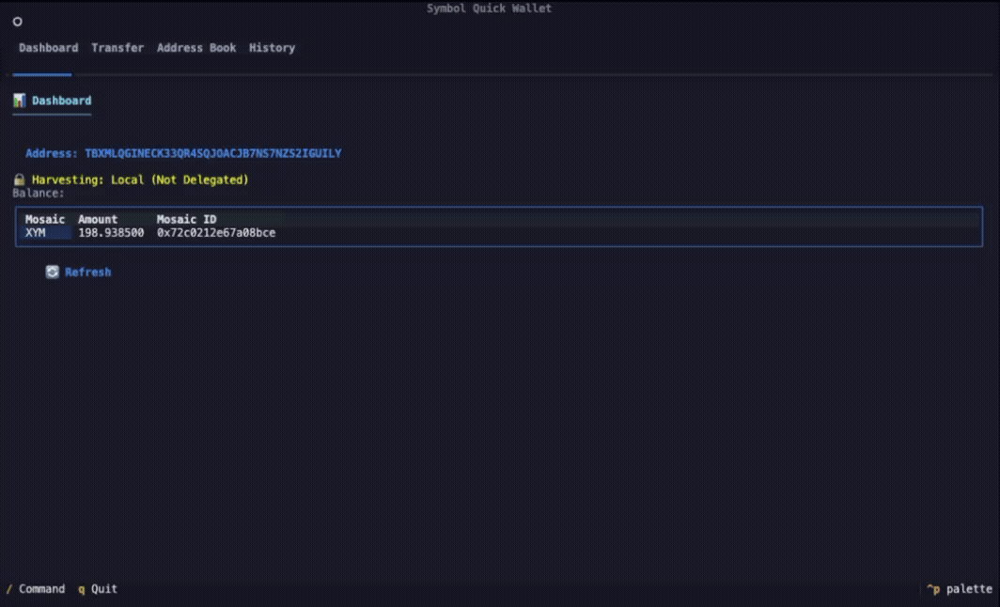

# Symbol Quick Wallet



[](https://pypi.org/project/symbol-quick-wallet/)
[](https://pypi.org/project/symbol-quick-wallet/)
[](https://pypi.org/project/symbol-quick-wallet/)

A terminal-first wallet for the Symbol blockchain.

## Features

- Encrypted local wallet storage
- Testnet/Mainnet support
- XYM and mosaic transfer with message support
- Human-friendly mosaic amount input (auto-converted to micro-units internally)
- Address book management
- Transaction history
- Clipboard support (including OSC52 fallback)
- Slash command palette (`/`) for app actions

## Installation

### pip

```bash
pip install symbol-quick-wallet
```

### uv

```bash
uv pip install symbol-quick-wallet
```

### From source

```bash
git clone https://github.com/yourusername/symbol-quick-wallet.git
cd symbol-quick-wallet
uv sync
```

## Quick Start

```bash
symbol-quick-wallet
```

On first launch:

1. Select network (`testnet` or `mainnet`)
2. Create or import a wallet
3. Unlock with your password

## Keyboard Controls

- `q`: Quit
- `/`: Open command selector
- `Tab` / `Shift+Tab`: Move focus
- `Enter`: Confirm/select
- `Esc`: Close dialog

## Slash Commands

Main navigation:

- `/dashboard`, `/d`
- `/transfer`, `/t`
- `/address_book`, `/a`
- `/history`, `/h`

Wallet/network actions:

- `/show_config`
- `/network_testnet`
- `/network_mainnet`
- `/node_default`
- `/test_connection`
- `/create_wallet`
- `/import_wallet`
- `/export_key`
- `/import_encrypted_key`
- `/show_qr`
- `/create_mosaic`
- `/link_harvesting`
- `/unlink_harvesting`

## Transfer Flow

1. Go to `Transfer`
2. Enter recipient address (or select from address book)
3. Add mosaic(s)
4. Enter amount in normal units (for example `1.25` XYM)
5. Enter optional message
6. Confirm send

During submission, the app shows a loading indicator and waits for transaction confirmation status.

## Default Nodes

- Testnet: `http://sym-test-01.opening-line.jp:3000`
- Mainnet: `http://sym-main-01.opening-line.jp:3000`

## Local Data

By default, wallet files are stored under one of these directories:

- `~/.config/symbol-quick-wallet/`
- `~/.symbol-quick-wallet/` (legacy)

Files:

- `wallet.json`
- `address_book.json`
- `config.json`
- `wallet.log`

## Development

```bash
uv run ty check src/
uv run ruff check src/
uv run pytest -q
```

## Security Notes

- Keep your password and private key secret
- Always test transfers on testnet before mainnet
- Use trusted nodes only

## License

MIT
